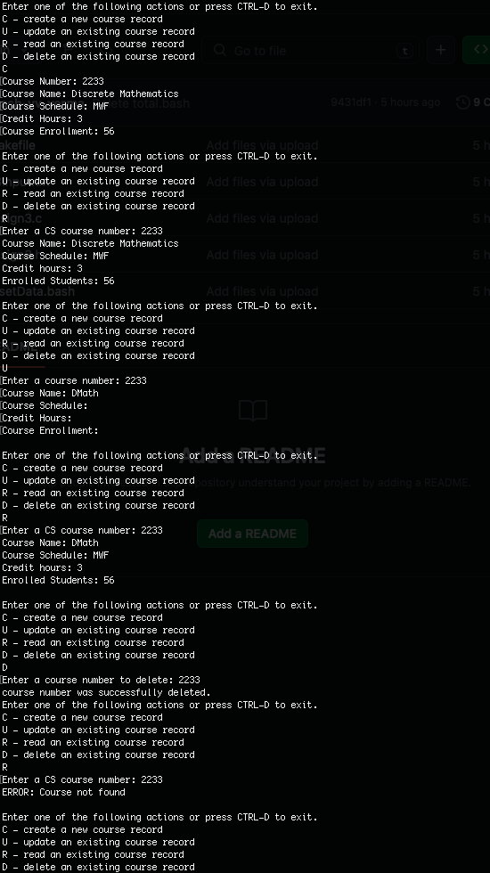

# CRUD for Course Management in C

This is a CRUD application developed in C. The application does CRUD operations on courses, and their information at my university: University of Texas, San Antonio (UTSA).

Click the image for a better view.

